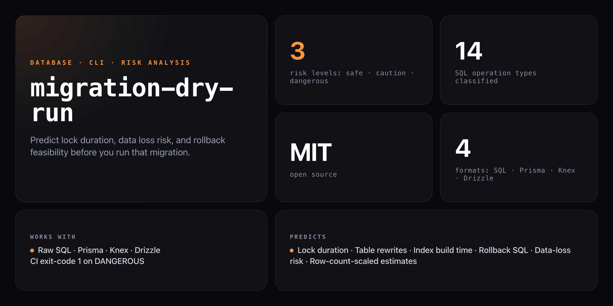

<div align="center">

**Predict migration impact before you run it. Because staging never has production data volumes.**


</div>

---

You ran a migration on production. It locked the `users` table for 8 minutes. 50,000 requests failed. The postmortem was awkward.

The problem wasn't the migration — it was that nobody predicted what it would do at scale. `migration-dry-run` analyzes every operation in your migration file and tells you: lock type, risk level, duration estimate (scaled to your real row counts), and the exact rollback SQL — before you touch production.

```
  MIGRATION-DRY-RUN  v1.0.0

  Analyzing migration...

  ── Operations ───────────────────────────────────────────────────
  1. ADD COLUMN users.avatar
     Lock: brief │ Risk: SAFE │ Rollback: easy
     ✓ Nullable column — no table rewrite needed. Metadata change only.

  2. ADD COLUMN (NOT NULL, default) orders.total
     Lock: full-table-rewrite │ Risk: CAUTION │ Rollback: medium
     ⚠ at 500,000 rows: ~500ms lock estimated
     💡 NOT NULL with default requires rewriting every row.

  3. DROP COLUMN orders.legacy_status
     Lock: full-table-rewrite │ Risk: DANGEROUS │ Rollback: impossible
     ⛔ Data will be permanently lost. No undo.

  4. CREATE INDEX idx_orders_user_id ON orders(user_id)
     Lock: concurrent-possible │ Risk: CAUTION │ Rollback: easy
     💡 Consider CREATE INDEX CONCURRENTLY to avoid locking reads/writes.

  ── Impact Summary ────────────────────────────────────────────────
  Total operations: 4  │  Safe: 1  │  Caution: 2  │  Dangerous: 1
  Est. total lock time: ~500ms

  Risk: DANGEROUS — 1 irreversible or high-risk operation detected

  ── Rollback Plan ─────────────────────────────────────────────────
  ✓  Op 1: ADD COLUMN [users]
       ALTER TABLE users DROP COLUMN avatar;
  ~  Op 2: ADD COLUMN (NOT NULL, default) [orders]
       ALTER TABLE orders DROP COLUMN total;
  ✗  Op 3: DROP COLUMN [orders]
       CANNOT ROLLBACK — data is permanently destroyed.
  ✓  Op 4: CREATE INDEX [orders]
       DROP INDEX idx_orders_user_id;

  ⚠  This migration is NOT fully reversible.
     Consider breaking into smaller, safer steps.
```

## Install

No npm account required — runs straight from GitHub:

```bash
npx github:NickCirv/migration-dry-run migration.sql
```

## Usage

```bash
# Analyze a single SQL migration
npx github:NickCirv/migration-dry-run migration.sql

# Analyze a directory of SQL files
npx github:NickCirv/migration-dry-run ./migrations/

# Prisma migrations
npx github:NickCirv/migration-dry-run --prisma ./prisma/migrations/

# Knex migrations
npx github:NickCirv/migration-dry-run --knex ./migrations/

# Provide real production row counts for duration estimates
npx github:NickCirv/migration-dry-run migration.sql --rows users:500000,orders:1200000

# JSON output (for CI/scripting)
npx github:NickCirv/migration-dry-run migration.sql --json

# CI mode — exit code 1 on any DANGEROUS operation
npx github:NickCirv/migration-dry-run migration.sql --strict
```

| Flag | Description |
|------|-------------|
| `[path]` | SQL file or migrations directory (defaults to current directory) |
| `--prisma` | Parse Prisma migration directories (`migration.sql` in each timestamped subdir) |
| `--knex` | Parse Knex JS migration files |
| `--rows <tables>` | Row count hints: `users:500000,orders:1000000` |
| `--json` | Output as JSON for CI/scripting |
| `--strict` | Exit code 1 if any DANGEROUS operation detected |

## What it predicts

| Operation | Lock Type | Risk |
|-----------|-----------|------|
| CREATE TABLE | None | Safe |
| ADD COLUMN (nullable) | Brief metadata | Safe |
| ADD COLUMN (NOT NULL, default) | Full table rewrite | Caution |
| ADD COLUMN (NOT NULL, no default) | Full table rewrite | **Dangerous** |
| DROP COLUMN | Full table rewrite | **Dangerous** |
| MODIFY COLUMN (type change) | Full table rewrite | **Dangerous** |
| RENAME COLUMN | Brief | Caution |
| CREATE INDEX | Concurrent possible | Caution |
| CREATE INDEX CONCURRENTLY | None | Safe |
| DROP INDEX | Brief | Caution |
| ADD FOREIGN KEY | Full table scan | Caution |
| ADD CONSTRAINT | Varies | Caution |
| DROP TABLE | Brief | **Dangerous** |
| UPDATE / DELETE (no WHERE) | Full table | **Dangerous** |

## Row-count-scaled estimates

Staging never reflects production data volumes. With `--rows`, duration estimates use your actual table sizes:

```bash
npx github:NickCirv/migration-dry-run migration.sql --rows users:2000000,orders:8000000
```

Duration model:
- Full table rewrite: ~1ms per 1,000 rows (500K rows ≈ 500ms lock)
- Index creation: ~2ms per 1,000 rows
- Foreign key validation: ~1ms per 1,000 rows

## Supported formats

| Format | Flag | Notes |
|--------|------|-------|
| Raw SQL | (default) | `.sql` files, any schema |
| Prisma | `--prisma` | Reads `migration.sql` from each timestamped directory |
| Knex | `--knex` | Parses JS migration files, schema builder API |
| Drizzle | (default) | Drizzle generates standard SQL — use default mode |

## CI integration

```yaml
- name: Dry run migration
  run: npx github:NickCirv/migration-dry-run ./migrations/ --strict
```

`--strict` exits with code 1 on any DANGEROUS operation. Safe and CAUTION operations pass.

## Programmatic API

```javascript
import { analyze } from 'migration-dry-run';

const { operations, risk } = await analyze(`
  ALTER TABLE users ADD COLUMN avatar TEXT;
  ALTER TABLE orders DROP COLUMN legacy_status;
`, { users: 500000, orders: 1200000 });

console.log(risk.overall);       // 'dangerous'
console.log(risk.hasIrreversible); // true
```

## What it is NOT

- **Not a migration runner.** It reads and analyzes migration files — it never connects to a database or executes SQL.
- **Not a guarantee.** Lock duration estimates are heuristic (~1ms/1K rows). Real-world timing depends on hardware, Postgres version, and concurrent load. Use as a planning signal, not a production SLA.
- **Not a replacement for a backup.** Operations flagged `CANNOT ROLLBACK` require a pre-migration snapshot regardless of what this tool says.

---

<div align="center">
<sub>Node 18+ · MIT · SQL · Prisma · Knex · Drizzle · by <a href="https://github.com/NickCirv">NickCirv</a></sub>
</div>
