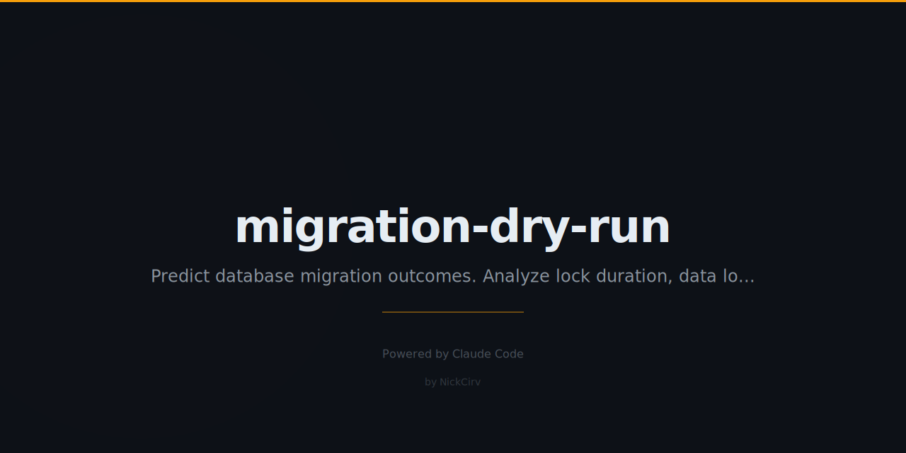

# migration-dry-run

**Don't run that migration until you've read this.**

[](https://npmjs.com/package/migration-dry-run)
[](#)
[](#supported-formats)

Predict migration impact before you run it. Analyzes SQL migration files and estimates table lock duration, rows affected, index rebuild time, rollback complexity, and overall risk. Supports raw SQL, Prisma, Drizzle, and Knex migrations.

---

## The Problem

> You ran a migration on production. It locked the `users` table for 8 minutes. 50,000 requests failed. The postmortem was awkward.

The issue wasn't the migration itself — it was that nobody predicted what it would do at scale. Staging never has production data volumes. You can't reproduce the lock duration there.

`migration-dry-run` estimates the impact before you touch production.

---

## Sample Output

```
  MIGRATION-DRY-RUN  v1.0.0

  Analyzing migration...

  ── Operations ───────────────────────────────────────────────────
  1. ADD COLUMN users.avatar
     Lock: brief │ Risk: SAFE │ Rollback: easy
     ✓ Nullable column — no table rewrite needed. Metadata change only.

  2. ADD COLUMN (NOT NULL, default) orders.total
     Lock: full-table-rewrite │ Risk: CAUTION │ Rollback: medium
     ⚠ at 500,000 rows: ~500ms lock estimated
     💡 NOT NULL with default requires rewriting every row.

  3. DROP COLUMN orders.legacy_status
     Lock: full-table-rewrite │ Risk: DANGEROUS │ Rollback: impossible
     ⛔ Data will be permanently lost. No undo.

  4. CREATE INDEX idx_orders_user_id ON orders(user_id)
     Lock: concurrent-possible │ Risk: CAUTION │ Rollback: easy
     💡 Consider CREATE INDEX CONCURRENTLY to avoid locking reads/writes.

  ── Impact Summary ────────────────────────────────────────────────
  Total operations: 4
  Safe:       1
  Caution:    2
  Dangerous:  1
  Est. total lock time: ~500ms

  Risk: DANGEROUS — 1 irreversible or high-risk operation detected

  ── Rollback Plan ─────────────────────────────────────────────────
  ✓  Op 1: ADD COLUMN [users]
       ALTER TABLE users DROP COLUMN avatar;
  ~  Op 2: ADD COLUMN (NOT NULL, default) [orders]
       ALTER TABLE orders DROP COLUMN total;
  ✗  Op 3: DROP COLUMN [orders]
       CANNOT ROLLBACK — Column data is permanently destroyed. Cannot recover without a backup.
  ✓  Op 4: CREATE INDEX [orders]
       DROP INDEX idx_orders_user_id;

  ⚠  This migration is NOT fully reversible.
     Consider breaking into smaller, safer steps.
```

---

## What It Predicts

| Operation | Lock Type | Risk |
|-----------|-----------|------|
| CREATE TABLE | None | Safe |
| ADD COLUMN (nullable) | Brief metadata | Safe |
| ADD COLUMN (NOT NULL, default) | Full table rewrite | Caution |
| ADD COLUMN (NOT NULL, no default) | Full table rewrite | **Dangerous** |
| DROP COLUMN | Full table rewrite | **Dangerous** |
| MODIFY COLUMN (type change) | Full table rewrite | **Dangerous** |
| RENAME COLUMN | Brief | Caution |
| CREATE INDEX | Concurrent possible | Caution |
| CREATE INDEX CONCURRENTLY | None | Safe |
| DROP INDEX | Brief | Caution |
| ADD FOREIGN KEY | Full table scan | Caution |
| DROP TABLE | Brief | **Dangerous** |
| UPDATE (no WHERE) | Full table | **Dangerous** |
| DELETE (no WHERE) | Full table | **Dangerous** |

---

## Installation

```bash
# Run without installing
npx migration-dry-run migration.sql

# Or install globally
npm install -g migration-dry-run
```

---

## Usage

```bash
# Analyze a single SQL migration
migration-dry-run migration.sql

# Analyze a directory of SQL files
migration-dry-run ./migrations/

# Analyze Prisma migrations
migration-dry-run --prisma ./prisma/migrations/

# Analyze Knex migrations
migration-dry-run --knex ./migrations/

# Provide row counts for duration estimation
migration-dry-run migration.sql --rows users:500000,orders:1200000

# JSON output (for CI/scripting)
migration-dry-run migration.sql --json

# CI mode — exit code 1 on DANGEROUS risk
migration-dry-run migration.sql --strict
```

---

## Row Count Estimation

Staging environments never reflect production data volumes. With `--rows`, you can tell the tool how big your tables actually are:

```bash
migration-dry-run migration.sql --rows users:2000000,orders:8000000
```

Duration estimates:
- Full table rewrite: ~1ms per 1,000 rows (500K rows ≈ 500ms lock)
- Index creation: ~2ms per 1,000 rows
- Foreign key validation: ~1ms per 1,000 rows

---

## Rollback Analysis

For every operation, the tool tells you:

- Can it be reversed?
- What's the reverse SQL?
- Is there data loss risk?

Operations marked `CANNOT ROLLBACK` need a backup strategy before running.

---

## Supported Formats

| Format | Flag | Notes |
|--------|------|-------|
| Raw SQL | (default) | `.sql` files, any schema |
| Prisma | `--prisma` | Reads `migration.sql` from each timestamped directory |
| Knex | `--knex` | Parses JS migration files, schema builder API |
| Drizzle | (default) | Drizzle generates standard SQL — use default mode |

---

## CI Integration

Add to your CI pipeline to block dangerous migrations:

```yaml
# GitHub Actions
- name: Dry run migration
  run: npx migration-dry-run ./migrations/ --strict
```

`--strict` exits with code 1 if any operation is rated DANGEROUS. Safe and CAUTION operations pass.

---

## Programmatic API

```javascript
import { analyze } from 'migration-dry-run';

const { operations, risk } = await analyze(`
  ALTER TABLE users ADD COLUMN avatar TEXT;
  ALTER TABLE orders DROP COLUMN legacy_status;
`, { users: 500000, orders: 1200000 });

console.log(risk.overall); // 'dangerous'
console.log(risk.hasIrreversible); // true
```

---

## Why Not Just Test on Staging?

Staging never has production data volumes. A migration that takes 2 seconds on staging can take 8 minutes on production with 10 million rows.

`migration-dry-run` estimates impact at scale using your actual row counts — before you commit to running it.

---

## License

MIT — Nicholas Ashkar, 2026
